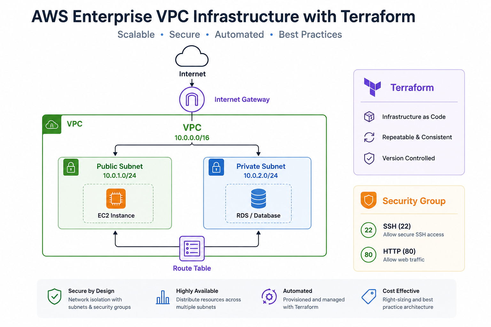
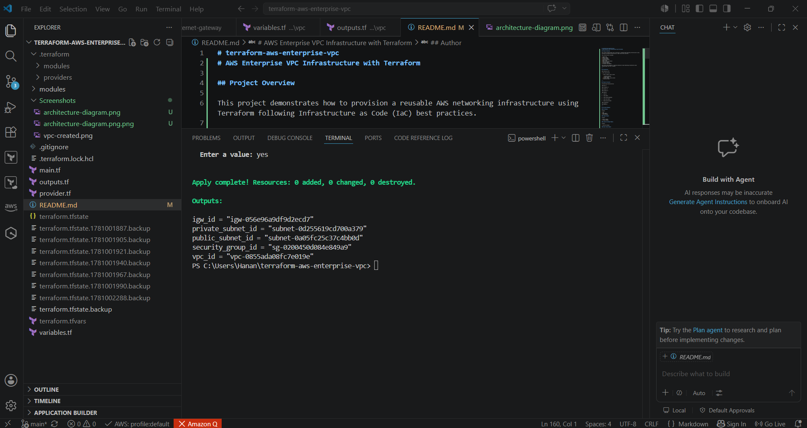

# terraform-aws-enterprise-vpc
# AWS Enterprise VPC Infrastructure with Terraform

## Project Overview

This project demonstrates how to provision a reusable AWS networking infrastructure using Terraform following Infrastructure as Code (IaC) best practices.

## Architecture Diagram

## Terraform Apply Result

The infrastructure includes:

* Amazon VPC
* Public Subnet
* Private Subnet
* Internet Gateway
* Route Table
* Route Table Association
* Security Group
* Terraform Modules
* Variables and Outputs

The project was designed to simulate enterprise cloud networking architecture while remaining AWS Free Tier friendly.

---

## Architecture

AWS Enterprise VPC

* VPC (10.0.0.0/16)

  * Public Subnet (10.0.1.0/24)

    * Internet Gateway
    * Route Table
  * Private Subnet (10.0.2.0/24)
  * Security Group

---

## Project Structure

terraform-aws-enterprise-vpc/

├── main.tf

├── variables.tf

├── outputs.tf

├── provider.tf

├── modules/

│   ├── vpc/

│   ├── subnet/

│   ├── internet-gateway/

│   ├── route-table/

│   └── security-group/

├── Screenshots/

└── README.md

---

## Terraform Modules

### VPC Module

Creates:

* VPC
* DNS Support
* DNS Hostnames

### Subnet Module

Creates:

* Public Subnet
* Private Subnet

### Internet Gateway Module

Creates:

* Internet Gateway

### Route Table Module

Creates:

* Public Route Table
* Route Association

### Security Group Module

Creates:

* SSH Access (Port 22)
* HTTP Access (Port 80)

---

## Deployment Steps

Initialize Terraform

terraform init

Validate Configuration

terraform validate

Review Execution Plan

terraform plan

Deploy Infrastructure

terraform apply

---

## Outputs

The deployment returns:

* VPC ID
* Public Subnet ID
* Private Subnet ID
* Security Group ID
* Internet Gateway ID

---

## Skills Demonstrated

* AWS Networking
* Terraform
* Infrastructure as Code (IaC)
* Git
* GitHub
* Cloud Architecture
* Modular Design
* AWS Security Fundamentals

---

## Author

Natthida Sirapongkulpoj

AWS Cloud re/start graduate, AI Consultant

Cloud Infrastructure | Terraform
